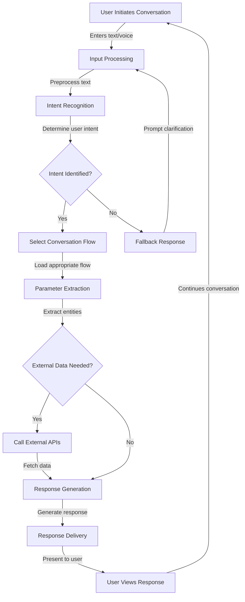
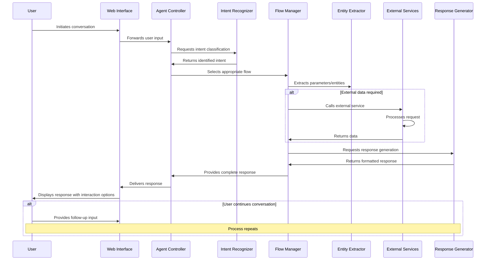
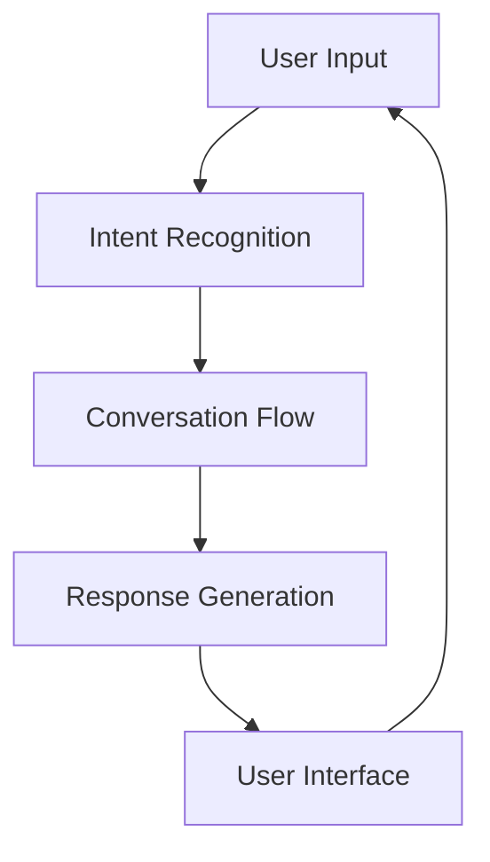

# 🤖 Herkey Chatbot - Asha AI Career Assistant 🚀

## 📋 Project Overview

Herkey Chatbot (officially named **Asha_AI_Chatbot**) is a conversational AI assistant designed to support women in their career development through the JobsForHer platform. Asha serves as a virtual career companion, providing guidance and resources across multiple career-focused domains.

## 🌟 Key Features

| Feature | Description | Implementation |
|---------|-------------|----------------|
| 👩‍💼 Job Search | Helps users find relevant job opportunities | JOB_SEARCH flow |
| 📅 Event Finder | Discovers career events and networking opportunities | FIND_EVENTS flow |
| 👨‍🏫 Mentorship | Connects users with mentorship resources | MENTORSHIP flow |
| 🧩 Passion Discovery | Helps explore career interests and paths | FIND_YOUR_PASSION flow |
| 👥 Community | Facilitates joining professional communities | JOIN_COMMUNITY flow |
| 📚 Learning Resources | Provides educational content and materials | LEARNING_RESOURCES flow |

## 🔄 Process Flow Diagram

The following diagram illustrates the complete conversation process flow from user input to response delivery:



## 🔀 Sequence Diagram

This sequence diagram shows the interaction between different components during a typical conversation:



## 🏗️ Technical Architecture



### 🧠 Core Components

1. **Agent Configuration** (`agent.json`):
   - Bot name: Asha_AI_Chatbot
   - Default language: English
   - Time zone: Asia/Colombo
   - Enhanced logging for diagnostics

2. **Intent Recognition** (`intents/`):
   - Trained phrases for recognizing user queries
   - Mapping user inputs to specific conversation flows
   - Custom intents for career-specific topics

3. **Conversation Flows** (`flows/`):
   - Structured conversation paths for different user needs
   - Default welcome flow with multiple response variations
   - Specialized flows for job search, mentorship, events, etc.

4. **Entity Types** (`entityTypes/`):
   - Structured data objects for key conversational entities
   - Parameter extraction from user inputs

5. **Webhooks** (`webhooks/`):
   - Integration points for external services
   - Real-time data fetching during conversations

## 💬 Conversation Flow Examples

### Default Welcome Flow

The chatbot initiates with friendly greetings such as:
> "Hi! I'm Asha, your AI career companion from JobsForHer. I'm dedicated to supporting your professional growth."

It then presents interactive option chips:
- Job Search
- Find Events
- Mentorship
- Resume Analysis
- Join Community
- Learning resources
- Find your passion
- Feedback

### 💼 Job Search Flow

Guides users through the job search process:
1. Collects job preferences and requirements
2. Delivers tailored job recommendations
3. Assists with application processes

### 🌱 Find Your Passion Flow

Helps users discover their career interests through:
1. Interest assessment questions
2. Skills evaluation
3. Career path recommendations

## 🛠️ Technical Implementation

- Built on Dialogflow CX framework
- Advanced NLU (Natural Language Understanding) model
- Classification threshold: 0.3 (30%)
- Speech-to-text capabilities configured
- Web client integration ready

## 📂 Directory Structure

```
herkey-chatbot/
├── agent.json              # Main chatbot configuration
├── entityTypes/            # Entity definitions
├── flows/                  # Conversation flows
│   ├── Default Start Flow/
│   ├── FIND_EVENTS/
│   ├── FIND_YOUR_PASSION/
│   ├── JOB_SEARCH/
│   ├── JOIN_COMMUNITY/
│   ├── LEARNING_RESOURCES/
│   └── MENTORSHIP/
├── generativeSettings/     # AI response generation settings
├── generators/             # Response generators
├── intents/                # Intent definitions with training phrases
├── playbooks/              # Conversation playbooks
└── webhooks/               # External service integrations
```

## 📈 Future Enhancement Possibilities

- Resume analysis and feedback capabilities
- Integration with job databases and recommendation engines
- Enhanced personalization based on user history
- Multi-language support for diverse communities
- Advanced analytics to improve conversation quality

## 💡 Getting Started

To implement this chatbot:
1. Set up a Dialogflow CX project
2. Import the repository contents
3. Configure webhooks for external integrations
4. Test and deploy the web client interface

---

*Asha AI Chatbot - Empowering professional journeys through conversation*