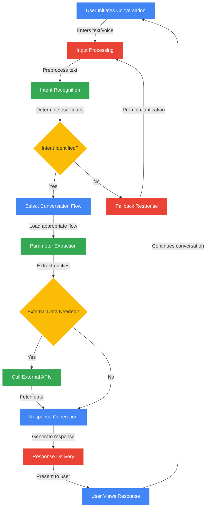
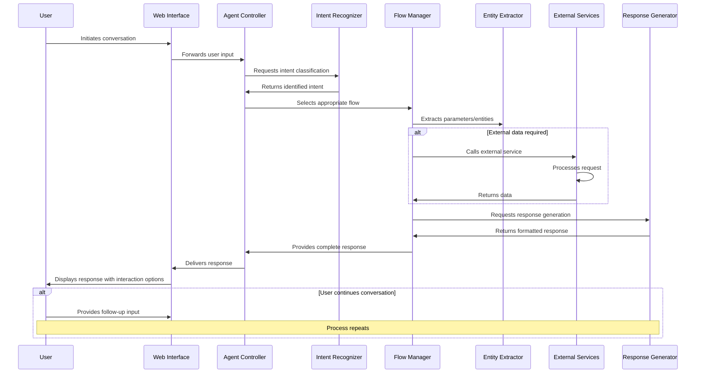
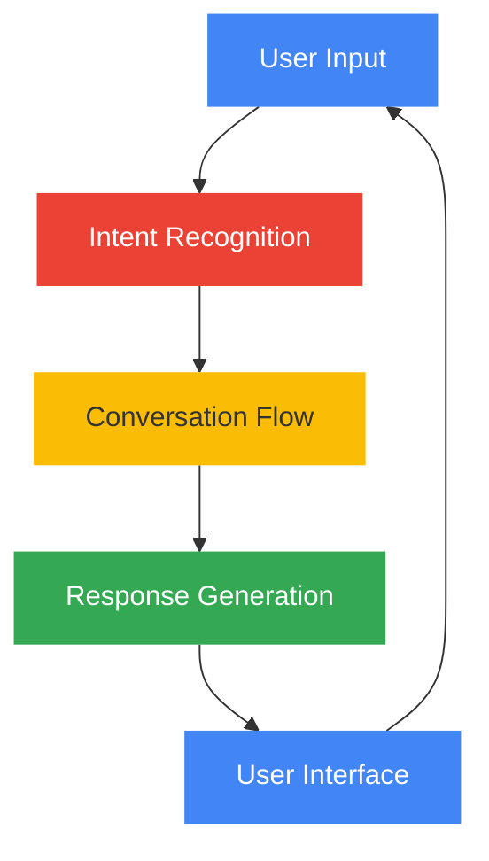
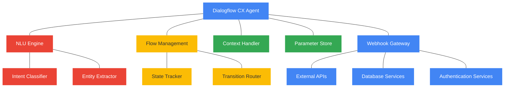
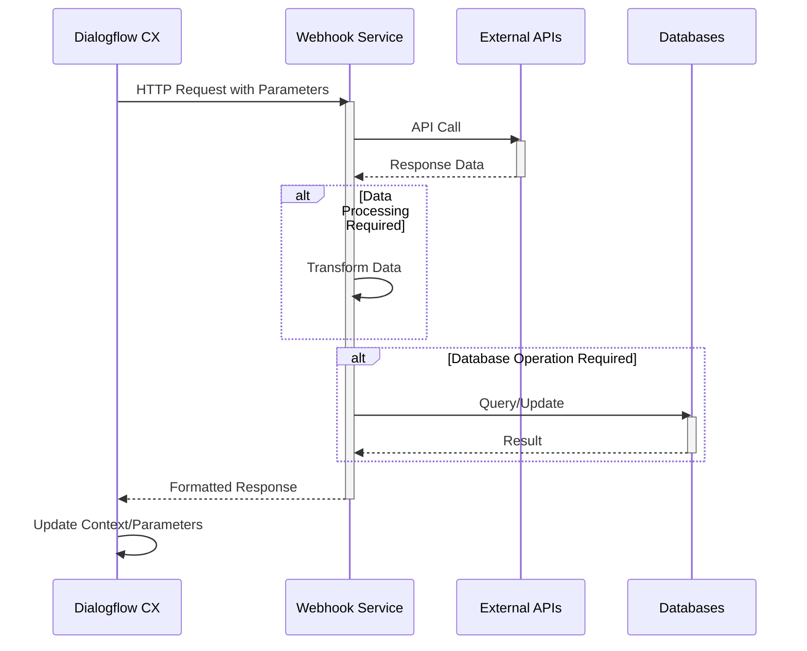
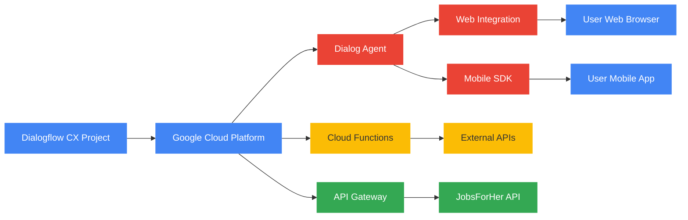

# 🤖 Herkey Chatbot - Asha AI Career Assistant 🚀

## 📋 Project Overview

Herkey Chatbot (officially named **Asha_AI_Chatbot**) is a conversational AI assistant designed to support women in their career development through the JobsForHer platform. Asha serves as a virtual career companion, providing guidance and resources across multiple career-focused domains.

## 🌟 Key Features

| Feature | Description | Implementation |
|---------|-------------|----------------|
| 👩‍💼 Job Search | Helps users find relevant job opportunities | JOB_SEARCH flow |
| 📅 Event Finder | Discovers career events and networking opportunities | FIND_EVENTS flow |
| 👨‍🏫 Mentorship | Connects users with mentorship resources | MENTORSHIP flow |
| 🧩 Passion Discovery | Helps explore career interests and paths | FIND_YOUR_PASSION flow |
| 👥 Community | Facilitates joining professional communities | JOIN_COMMUNITY flow |
| 📚 Learning Resources | Provides educational content and materials | LEARNING_RESOURCES flow |

## 🔄 Process Flow Diagram

The following diagram illustrates the complete conversation process flow from user input to response delivery:



## 🔀 Sequence Diagram

This sequence diagram shows the interaction between different components during a typical conversation:



## 🏗️ Technical Architecture



### 🧠 Core Components

1. **Agent Configuration** (`agent.json`):
   - Bot name: Asha_AI_Chatbot
   - Default language: English
   - Time zone: Asia/Colombo
   - Enhanced logging for diagnostics

2. **Intent Recognition** (`intents/`):
   - Trained phrases for recognizing user queries
   - Mapping user inputs to specific conversation flows
   - Custom intents for career-specific topics

3. **Conversation Flows** (`flows/`):
   - Structured conversation paths for different user needs
   - Default welcome flow with multiple response variations
   - Specialized flows for job search, mentorship, events, etc.

4. **Entity Types** (`entityTypes/`):
   - Structured data objects for key conversational entities
   - Parameter extraction from user inputs

5. **Webhooks** (`webhooks/`):
   - Integration points for external services
   - Real-time data fetching during conversations

## 💬 Conversation Flow Examples

### Default Welcome Flow

The chatbot initiates with friendly greetings such as:
> "Hi! I'm Asha, your AI career companion from JobsForHer. I'm dedicated to supporting your professional growth."

It then presents interactive option chips:
- Job Search
- Find Events
- Mentorship
- Resume Analysis
- Join Community
- Learning resources
- Find your passion
- Feedback

### 💼 Job Search Flow

Guides users through the job search process:
1. Collects job preferences and requirements
2. Delivers tailored job recommendations
3. Assists with application processes

### 🌱 Find Your Passion Flow

Helps users discover their career interests through:
1. Interest assessment questions
2. Skills evaluation
3. Career path recommendations

## 🛠️ Technical Implementation Details

### 🔌 Dialogflow CX Framework Architecture



### 🧪 Technical Specifications

| Component | Specification | Details |
|-----------|---------------|---------|
| 🔍 NLU Model | MODEL_TYPE_ADVANCED | ML-based intent classification with 30% threshold |
| 🔄 Conversation Management | State-based | Uses Dialogflow CX states, routes, and handlers |
| 🔊 Speech Processing | Enhanced STT | Sensitivity: 90, No-speech timeout: 5s |
| 🌐 Web Integration | Custom UI | Interface with chip-based quick responses |
| 📊 Logging | Stackdriver | Comprehensive interaction logging enabled |
| 🔒 Data Compliance | DATA_RESIDENCY_IN_USE_COMPLIANT | Complies with regional data regulations |

### 🧩 NLU Engine Technical Details

The Natural Language Understanding (NLU) engine implements:

- **Intent Classification**: 
  - Uses ML-based model with advanced classification
  - Threshold configured at 30% for intent matching confidence
  - Training phrases optimized for career-related terminology

- **Entity Recognition**:
  - Extracts structured data from user utterances
  - Maps to predefined entity types for processing
  - Supports composite entities for complex information

- **Context Management**:
  - Maintains conversational state across interactions
  - Handles parameter lifespan and scoping
  - Manages slot-filling for form-based interactions

### 🔗 Webhook Integration Specifications



#### Webhook Technical Details:

- **Protocol**: REST API with JSON payloads
- **Authentication**: OAuth 2.0 for secure API communication
- **Response Format**: Structured JSON with fulfillment messages
- **Timeout**: Configured for 5-second maximum response time
- **Retry Logic**: Built-in retry mechanism for failed requests

### 💻 Implementation Technologies

| Component | Technology | Purpose |
|-----------|------------|---------|
| 🧠 Conversational Engine | Dialogflow CX | Core NLU and conversation management |
| 🌐 Frontend Integration | Web SDK | Browser-based chat interface |
| 🔄 Backend Services | Cloud Functions | Webhook implementation for data access |
| 📊 Analytics | Stackdriver | Interaction logging and performance metrics |
| 🔐 Security | OAuth 2.0 | API authentication and authorization |

### 📱 Integration Capabilities

The chatbot can be integrated across multiple channels:

- **Web**: JavaScript SDK for website embedding
- **Mobile**: Android/iOS SDK for native app integration
- **Messaging Platforms**: Integration with popular messaging services
- **Voice**: IVR systems and voice assistant integration
- **Custom APIs**: Direct API access for custom implementations

## 📂 Directory Structure

```
herkey-chatbot/
├── agent.json              # Main chatbot configuration
│   ├── displayName         # Bot name (Asha_AI_Chatbot)
│   ├── defaultLanguageCode # Default language (en)
│   ├── timeZone            # Time zone (Asia/Colombo)
│   ├── speechSettings      # Speech recognition configuration
│   └── loggingSettings     # Logging configuration
│
├── entityTypes/            # Entity definitions
│   └── [Entity Type]/      # Individual entity definitions
│
├── flows/                  # Conversation flows
│   ├── Default Start Flow/ # Initial conversation entry
│   │   ├── pages/          # Flow pages/states
│   │   └── transitions/    # Flow navigation rules
│   ├── FIND_EVENTS/        # Event discovery flow
│   ├── FIND_YOUR_PASSION/  # Career interest exploration
│   ├── JOB_SEARCH/         # Job search assistance
│   ├── JOIN_COMMUNITY/     # Community joining flow
│   ├── LEARNING_RESOURCES/ # Educational content access
│   └── MENTORSHIP/         # Mentorship connection
│
├── generativeSettings/     # AI response generation settings
│   └── responseGeneration/ # Response generation rules
│
├── generators/             # Response generators
│   └── templates/          # Response templates
│
├── intents/                # Intent definitions with training phrases
│   ├── Default Welcome Intent/ # Initial greeting recognition
│   │   └── trainingPhrases/    # Example user inputs
│   ├── job_search/         # Job search intent
│   ├── Find your passion/  # Career interest intent
│   └── [Other Intents]/    # Additional intent definitions
│
├── playbooks/              # Conversation playbooks
│   └── mentorship/         # Mentorship conversation strategies
│
└── webhooks/               # External service integrations
    └── [Service Name]/     # Individual webhook configurations
```

## 🚀 Deployment and Infrastructure



### 🌈 Google Brand Color Palette

The diagrams utilize Google's official brand colors to maintain consistent visual identity with Dialogflow CX:

| Color | Hex Code | Usage |
|-------|----------|-------|
|  Blue | #4285F4 | Primary user interactions, interfaces |
|  Red | #EA4335 | Core processing components |
|  Yellow | #FBBC05 | Decision points, flow control |
|  Green | #34A853 | Data storage, successful operations |

### 🔧 Deployment Process

1. **Environment Setup**:
   - Configure Google Cloud Project
   - Setup Dialogflow CX agent
   - Configure service accounts and permissions

2. **Agent Deployment**:
   - Import agent configuration from repository
   - Configure NLU settings and thresholds
   - Setup webhook endpoints

3. **Integration Configuration**:
   - Configure web client parameters
   - Setup channel-specific integrations
   - Connect external API credentials

4. **Testing and Validation**:
   - Perform intent recognition validation
   - Test conversation flows
   - Validate webhook functionality

5. **Monitoring Setup**:
   - Configure logging and analytics
   - Setup alerting for critical failures
   - Implement conversation metrics tracking

## 📈 Future Enhancement Possibilities

- Resume analysis and feedback capabilities
- Integration with job databases and recommendation engines
- Enhanced personalization based on user history
- Multi-language support for diverse communities
- Advanced analytics to improve conversation quality

## 💡 Getting Started

To implement this chatbot:
1. Set up a Dialogflow CX project
2. Import the repository contents
3. Configure webhooks for external integrations
4. Test and deploy the web client interface

---

*Asha AI Chatbot - Empowering professional journeys through conversation*