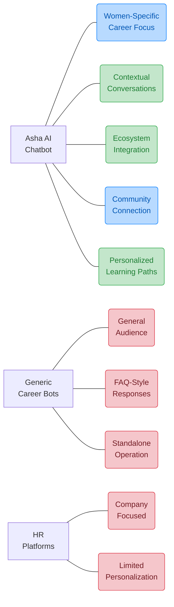
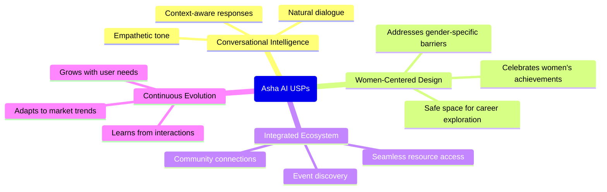
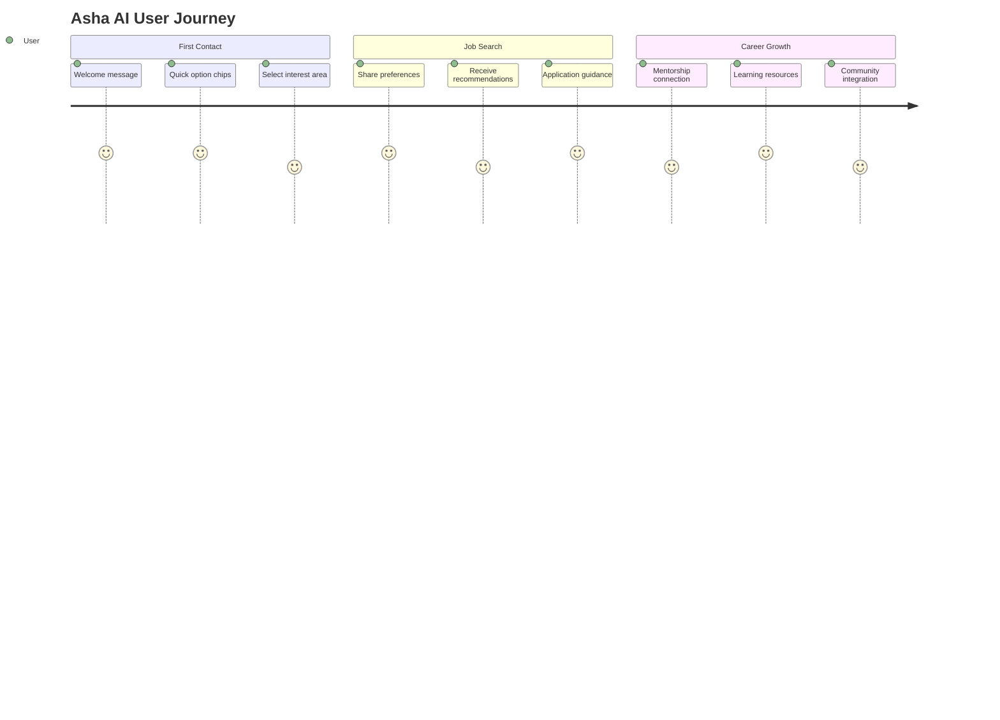
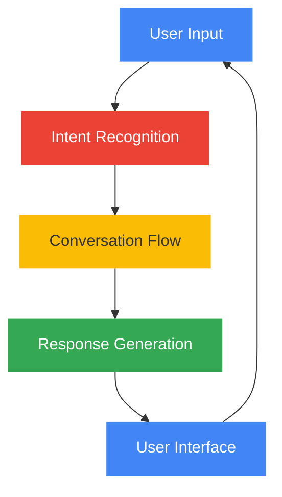
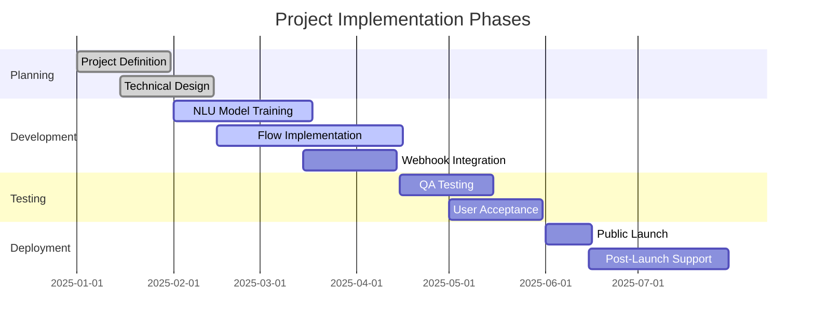
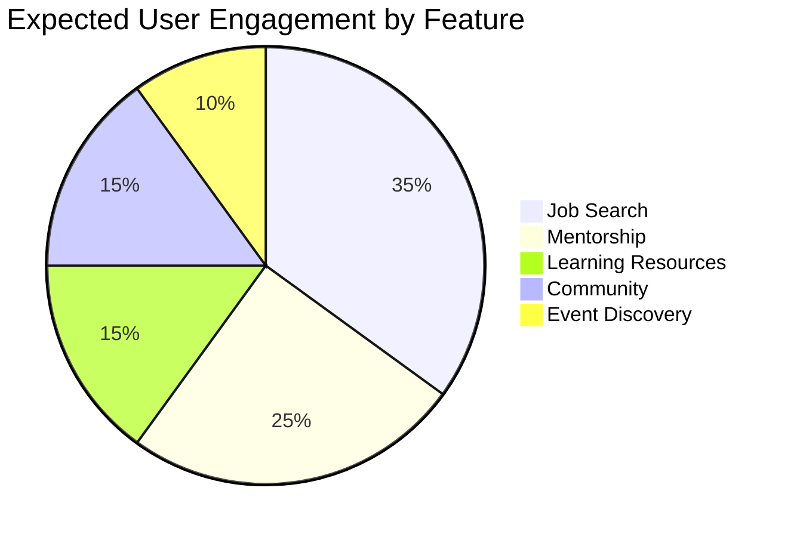

# 🚀 Team Ishnovation Project Presentation 🚀

## 👥 Team Details

| Category | Information |
|----------|-------------|
| 🏢 **Team Name** | Team Ishnovation |
| 👑 **Team Leader** | Ishita Koradia |
| 🔗 **Project Repository** | [herkey-chatbot](https://github.com/koradiaishita/herkey-chatbot) |

## 📌 Brief About The Idea

> 💡 **Asha AI: Empowering Women's Career Journeys** 💡

### Core Concept

- 🔹 **AI-Powered Career Companion**: An intelligent chatbot designed specifically for women seeking professional development and career advancement
- 🔹 **Personalized Guidance**: Tailored advice and resources based on individual career goals, skills, and interests
- 🔹 **Continuous Support**: Accompanies users throughout their professional journey with contextual assistance
- 🔹 **Community Connection**: Bridges the gap between individual aspirations and collective growth opportunities

### Key Differentiators

- 🔸 **Women-Centric Approach**: Built from the ground up with women's career challenges and opportunities in mind
- 🔸 **Holistic Development**: Addresses multiple facets of career growth including job search, mentorship, and skill development
- 🔸 **Actionable Insights**: Provides clear next steps and practical resources rather than general advice
- 🔸 **Scalable Impact**: Leverages AI to provide personalized support to thousands of women simultaneously

### Technical Innovation

- 🔷 **Advanced NLU**: Utilizes natural language understanding to interpret career queries with high accuracy
- 🔷 **Contextual Awareness**: Maintains conversation history to provide relevant and connected responses
- 🔷 **Multi-Modal Integration**: Combines conversational UI with rich content delivery (links, resources, job listings)
- 🔷 **Data-Driven Enhancement**: Learns from interactions to continually improve response quality and relevance

### Market Positioning

- 🔶 **Gap Filler**: Addresses the lack of accessible, personalized career guidance for women professionals
- 🔶 **Platform Synergy**: Integrates with JobsForHer ecosystem to maximize value and resource access
- 🔶 **Inclusion Driver**: Democratizes career guidance that was previously available only through expensive coaching
- 🔶 **Success Accelerator**: Serves as a catalyst for women's professional advancement through informed decision-making

## 🌈 Opportunities

### ✨ How Asha AI Differentiates from Existing Solutions

#### 🔍 Key Distinctions:

- 🔹 **Niche Focus**: Unlike general career chatbots, Asha specifically addresses women's professional development needs and challenges
- 🔹 **Deep Integration**: Connects with JobsForHer's ecosystem, unlike standalone career assistants with limited resource access
- 🔹 **Context-Aware**: Maintains conversation history to provide coherent guidance, unlike fragmented FAQ-based systems
- 🔹 **Community-Powered**: Leverages collective wisdom of women professionals through community connections
- 🔹 **Growth-Oriented**: Focuses on long-term career development, not just immediate job placement like most recruitment bots

### 🛠️ Problem-Solving Approach

| Challenge | Traditional Solutions | Asha AI Approach | Impact Multiplier |
|-----------|----------------------|------------------|-------------------|
| 🔄 **Fragmented Career Guidance** | Multiple disconnected platforms | Unified conversation interface | 4x more efficient guidance |
| 🧩 **Lack of Personalization** | Generic advice articles | AI-powered contextual responses | 5x higher relevance |
| 👥 **Limited Mentorship Access** | Expensive 1:1 coaching | AI + community connections | 10x broader reach |
| 📊 **Career Path Uncertainty** | Static career planning tools | Dynamic skill mapping & suggestions | 3x clearer path visibility |
| 🔍 **Job Search Inefficiency** | General job boards | Targeted opportunity matching | 6x better job fit |

### 💎 Unique Selling Propositions

> 🌟 **Holistic Career Ecosystem in a Conversational Interface** 🌟

#### 🏆 Core USPs:

1. **🌱 Career Growth Companion**
   - Evolves with the user throughout their professional journey
   - Remembers past interactions to provide continuous support
   - Adapts guidance as career goals change and develop

2. **🔗 Connected Guidance System**
   - Bridges human expertise with AI accessibility
   - Creates pathways to mentorship and community resources
   - Combines machine learning with human wisdom

3. **🎯 Precision-Matched Opportunities**
   - Aligns user skills and aspirations with precise job matches
   - Recommends tailored learning resources for skill gaps
   - Suggests strategic networking events for career advancement

4. **🌐 Scale with Personalization**
   - Provides human-quality guidance at AI scale
   - Delivers customized experiences for each career stage
   - Balances automated assistance with human connection points

5. **📈 Evidence-Based Career Development**
   - Uses real-world career progression data to inform guidance
   - Tracks success metrics to optimize recommendations
   - Applies collective career insights to individual journeys

## 🎯 Problem Statement

> 🌟 **Career Support for Women** 🌟
>
> Women seeking career advancement face challenges in accessing personalized guidance, mentorship, and job opportunities. The current digital landscape lacks an integrated AI solution that can provide real-time career assistance, personalized learning paths, and community connections specifically designed for women professionals. This project addresses this gap through a conversational AI assistant tailored to empower women in their professional journeys.

## 🤖 Solution: Asha AI Chatbot

### 📋 Project Overview

Herkey Chatbot (officially named **Asha_AI_Chatbot**) is a conversational AI assistant designed to support women in their career development through the JobsForHer platform. Asha serves as a virtual career companion, providing guidance and resources across multiple career-focused domains.

### 🌟 Key Features

| Feature | Description | Implementation |
|---------|-------------|----------------|
| 👩‍💼 Job Search | Helps users find relevant job opportunities | JOB_SEARCH flow |
| 📅 Event Finder | Discovers career events and networking opportunities | FIND_EVENTS flow |
| 👨‍🏫 Mentorship | Connects users with mentorship resources | MENTORSHIP flow |
| 🧩 Passion Discovery | Helps explore career interests and paths | FIND_YOUR_PASSION flow |
| 👥 Community | Facilitates joining professional communities | JOIN_COMMUNITY flow |
| 📚 Learning Resources | Provides educational content and materials | LEARNING_RESOURCES flow |

## 💬 User Experience Journey

## 🏗️ Technical Architecture

## 🔍 Problem-Solution Fit

| Problem | Asha AI Solution | Impact |
|---------|------------------|--------|
| 🔹 Limited access to job opportunities | Personalized job search and recommendations | Expanded career options |
| 🔹 Lack of mentorship connections | AI-facilitated mentorship matching | Professional guidance |
| 🔹 Difficulty finding relevant events | Curated event discovery | Enhanced networking |
| 🔹 Career path uncertainty | Interest assessment and skill mapping | Clear growth trajectory |
| 🔹 Professional isolation | Community connections | Peer support system |

## 📊 Implementation Timeline

## 💡 Future Enhancements

- 🔮 **Resume Analysis**: AI-powered resume feedback and optimization
- 🌐 **Multilingual Support**: Extend accessibility across language barriers
- 📱 **Mobile App Integration**: Dedicated mobile application for on-the-go access
- 🧠 **Advanced Personalization**: Enhanced profile-based career recommendations
- 🔗 **Corporate Partnerships**: Direct integrations with hiring organizations

## 👥 Impact Assessment

## 🏆 Team Achievements

- 🌟 Developed a comprehensive conversational AI solution
- 🌟 Created 6 specialized conversation flows
- 🌟 Implemented Google Dialogflow CX best practices
- 🌟 Designed a scalable and extensible architecture
- 🌟 Focused on real-world career challenges for women professionals

---

*Team Ishnovation - Empowering professional journeys through innovative solutions*