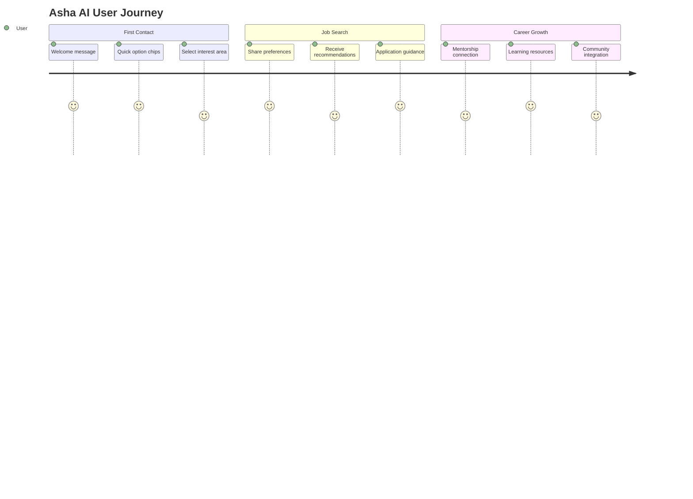
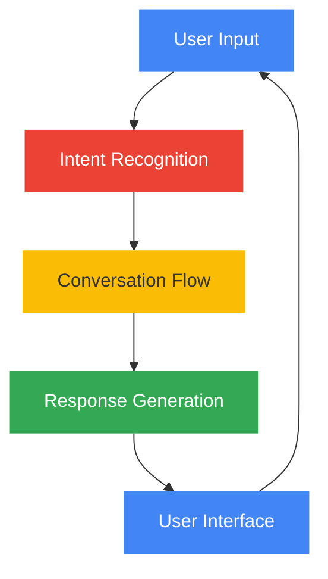
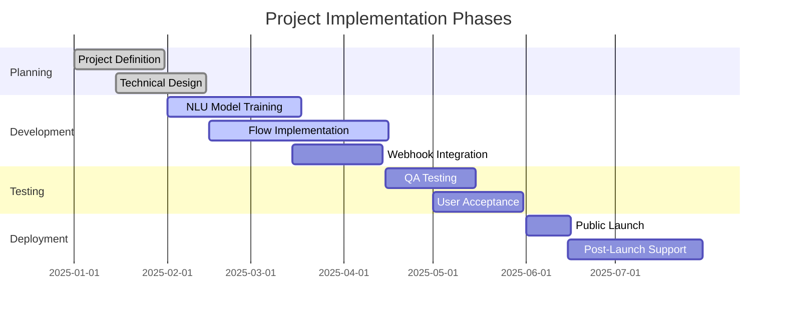
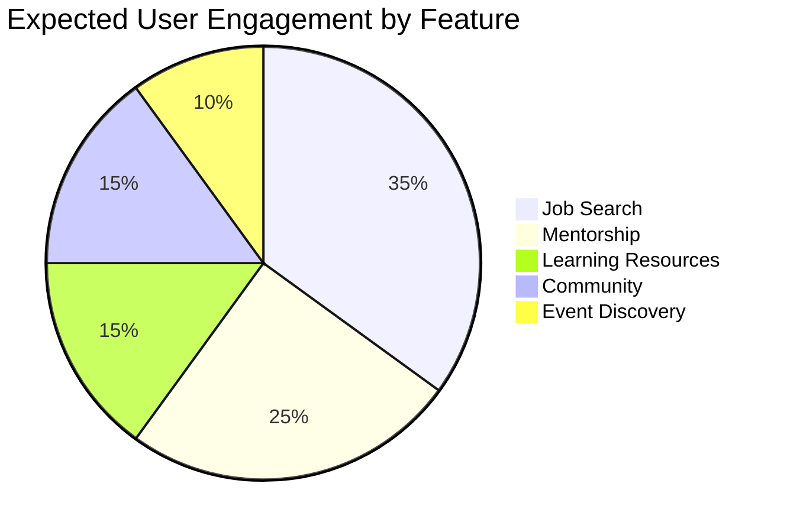

# 🚀 Team Ishnovation Project Presentation 🚀

## 👥 Team Details

| Category | Information |
|----------|-------------|
| 🏢 **Team Name** | Team Ishnovation |
| 👑 **Team Leader** | Ishita Koradia |
| 🔗 **Project Repository** | [herkey-chatbot](https://github.com/koradiaishita/herkey-chatbot) |

## 🎯 Problem Statement

> 🌟 **Career Support for Women** 🌟
>
> Women seeking career advancement face challenges in accessing personalized guidance, mentorship, and job opportunities. The current digital landscape lacks an integrated AI solution that can provide real-time career assistance, personalized learning paths, and community connections specifically designed for women professionals. This project addresses this gap through a conversational AI assistant tailored to empower women in their professional journeys.

## 🤖 Solution: Asha AI Chatbot

### 📋 Project Overview

Herkey Chatbot (officially named **Asha_AI_Chatbot**) is a conversational AI assistant designed to support women in their career development through the JobsForHer platform. Asha serves as a virtual career companion, providing guidance and resources across multiple career-focused domains.

### 🌟 Key Features

| Feature | Description | Implementation |
|---------|-------------|----------------|
| 👩‍💼 Job Search | Helps users find relevant job opportunities | JOB_SEARCH flow |
| 📅 Event Finder | Discovers career events and networking opportunities | FIND_EVENTS flow |
| 👨‍🏫 Mentorship | Connects users with mentorship resources | MENTORSHIP flow |
| 🧩 Passion Discovery | Helps explore career interests and paths | FIND_YOUR_PASSION flow |
| 👥 Community | Facilitates joining professional communities | JOIN_COMMUNITY flow |
| 📚 Learning Resources | Provides educational content and materials | LEARNING_RESOURCES flow |

## 💬 User Experience Journey

## 🏗️ Technical Architecture

## 🔍 Problem-Solution Fit

| Problem | Asha AI Solution | Impact |
|---------|------------------|--------|
| 🔹 Limited access to job opportunities | Personalized job search and recommendations | Expanded career options |
| 🔹 Lack of mentorship connections | AI-facilitated mentorship matching | Professional guidance |
| 🔹 Difficulty finding relevant events | Curated event discovery | Enhanced networking |
| 🔹 Career path uncertainty | Interest assessment and skill mapping | Clear growth trajectory |
| 🔹 Professional isolation | Community connections | Peer support system |

## 📊 Implementation Timeline

## 💡 Future Enhancements

- 🔮 **Resume Analysis**: AI-powered resume feedback and optimization
- 🌐 **Multilingual Support**: Extend accessibility across language barriers
- 📱 **Mobile App Integration**: Dedicated mobile application for on-the-go access
- 🧠 **Advanced Personalization**: Enhanced profile-based career recommendations
- 🔗 **Corporate Partnerships**: Direct integrations with hiring organizations

## 👥 Impact Assessment

## 🏆 Team Achievements

- 🌟 Developed a comprehensive conversational AI solution
- 🌟 Created 6 specialized conversation flows
- 🌟 Implemented Google Dialogflow CX best practices
- 🌟 Designed a scalable and extensible architecture
- 🌟 Focused on real-world career challenges for women professionals

---

*Team Ishnovation - Empowering professional journeys through innovative solutions*